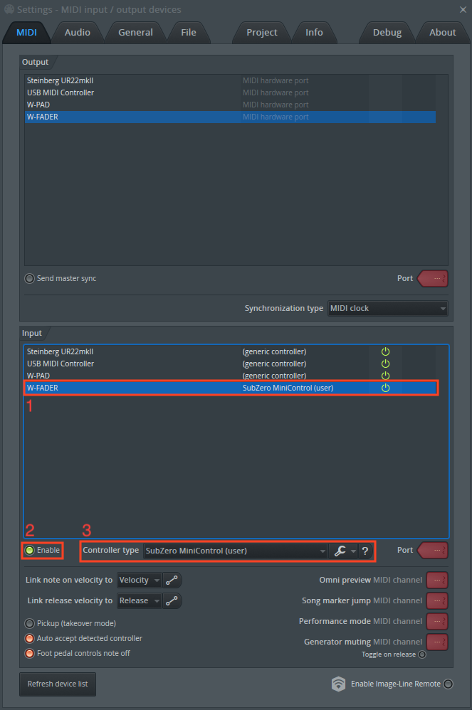

# FL Studio Controller mapping for SubZero MiniControl

This scripts maps the SubZero MiniControl for FL Studio. It currently supports controlling the pan, volume and mute of the first 8 mixer tracks, and the master channel. It also has full transport control.

Pressing the "BANK" button changes the bank. Bank 1 makes the faders control channel 1-8. Bank 2 controls channel 9-16 etc.

## Installation

* Copy the folder "SubZero MiniControl" into the User data folder under `.../Documents/Image-Line/FL Studio/Settings/Hardware`

* Open the MIDI settings (F10)
    1. Under "Input" find the device (Usually called "W-FADER")
    2. Ensure the device is enabled.
    3. Select SubZero MiniControl (User) as the controller type.
